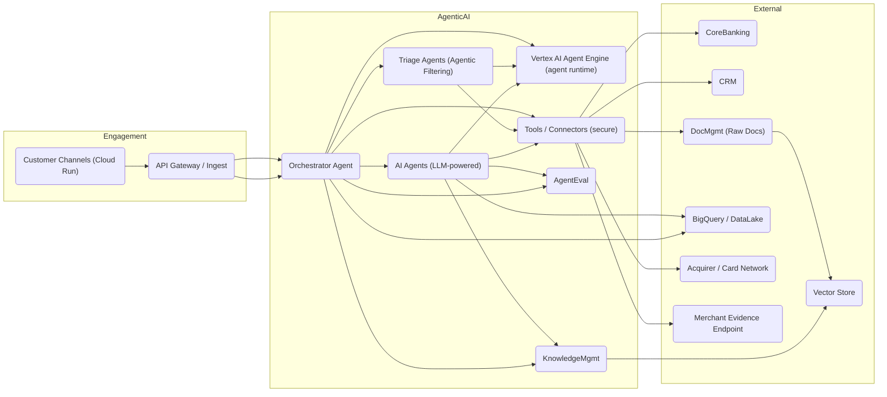
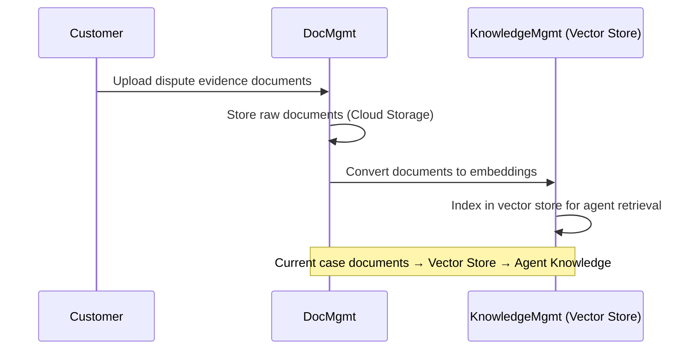
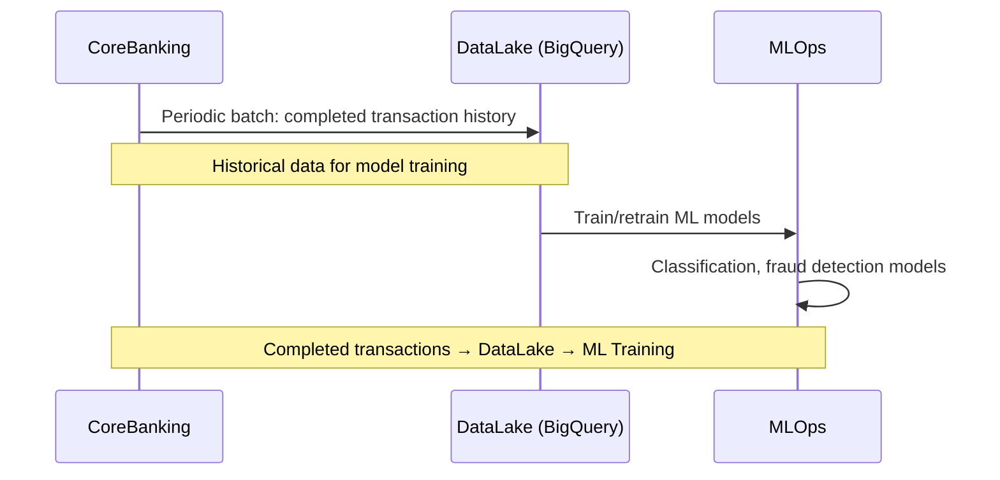
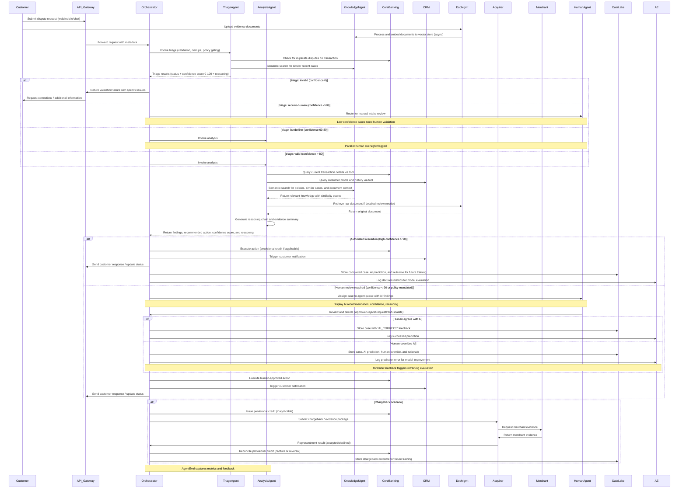

# Architectural Overview: Agentic AI-Powered Credit Card Dispute Resolution System (Updated)

## 1. System Context
The Agentic AI-Powered Credit Card Dispute Resolution System (AIDRS) is designed to automate and enhance the end-to-end handling of credit card disputes and chargeback workflows. The system is cloud-native and will integrate with the bank's core banking systems, CRM and communication channels, merchant/acquirer channels, document stores, and internal operational tools. Channel applications (web and mobile) and stateless services are hosted on Cloud Run, while all agent implementations (orchestrator, triage, analysis agents) are deployed and executed on **Vertex AI Agent Engine** using the **Google ADK**.

## 2. High-Level Architecture Diagram (Conceptual)



## 2.1 End-to-end Sequence (Conceptual)

### 2.1.1 Data Ingestion Flows





### 2.1.2 Dispute Resolution Flow



## 3. Core Architectural Components

This section maps directly to the simplified diagram: an Engagement layer that receives and normalizes customer input; the Agentic AI layers that orchestrate and run AI agents plus support services; and External services & data that provide authoritative records and downstream integrations.

### 3.1. Engagement
- **Customer Channels**: 
  - **Web Portal**: Responsive web application built with modern framework (React/Vue), hosted on Cloud Run. Supports dispute submission, document upload, status tracking, and evidence provision.
  - **Mobile Apps**: Native iOS/Android apps or Progressive Web App (PWA) for mobile-first dispute initiation, biometric authentication, and push notifications.
  - **Chatbot**: Conversational AI interface for guided dispute intake and status queries, integrated with customer channels.
  - All channel applications deployed as serverless containers on Cloud Run for auto-scaling and cost efficiency.
- **API Gateway / Ingest**: A managed API Gateway (Cloud Endpoints or Apigee) provides authentication (OAuth2/OIDC), rate limiting, request normalization, and routing. Channel apps call the Orchestrator Agent via the API Gateway; the Orchestrator Agent then coordinates agentic workflows on Vertex AI.
- **Lightweight Preprocessing**: Thin ingest services perform protocol-level validation (schema validation, authentication) and handle multi-part document uploads. Raw documents are stored in Document Management (Cloud Storage), then asynchronously converted to embeddings and indexed in the Knowledge Management vector store. Business-level validation, deduplication, policy gating and completeness checks are performed by dedicated triage agents in the Agentic AI layer (see below).

### 3.2. Agentic AI Layers
- **Orchestrator Agent**: The Orchestrator is itself an agent (deployed on Vertex AI Agent Engine) responsible for receiving requests from the API Gateway and sequencing work across triage agents, analysis agents, tools/connectors, and human workbenches. The Orchestrator coordinates retries, timeouts, provisional-credit decisions and chargeback submissions. It maintains workflow state and handles escalations based on confidence scores and business rules.
- **Triage Agents**: Specialized agent(s) perform multi-stage validation and filtering:
  - **Schema Validation**: Verify required fields and data types
  - **Duplicate Detection**: Check for existing disputes on same transaction
  - **Policy Gating**: Apply business rules (transaction date windows, dispute type eligibility, cardholder verification)
  - **Evidence Completeness**: Assess if sufficient evidence exists for processing
  - **Confidence Scoring**: Generate 0-100 confidence score indicating case processability
  - **Escalation Logic**: Cases with confidence < 60 route to human review; 60-80 flagged for parallel human oversight; >80 proceed to automated analysis
  - Output: Valid/Invalid/RequireHuman status with detailed reasoning
- **Analysis Agents**: LLM-powered agents (NLP, evidence extraction, classification, fraud scoring, summarization, and response generation) run on Vertex via Google ADK. These agents produce findings, recommended actions (Approve/Reject/RequestInfo/Escalate), confidence scores, and structured evidence packages for representment. Support both automated resolution and agent-assist modes.
- **Agent Tools / Connectors**: Hardened connector services (tools) provide auditable, least-privilege access to backend systems — transaction lookups, provisional-credit operations, DMS retrieval, CRM queries, and acquirer/merchant endpoints. Agents invoke tools rather than holding direct credentials. All tool invocations logged for compliance and debugging.
- **Knowledge Management (Vector Store)**: Semantic search layer that stores vector embeddings of:
  - **Static Knowledge**: Policies, FAQs, regulatory guidelines, resolution procedures
  - **Dynamic Knowledge**: Current case documents (uploaded evidence), past resolution patterns, similar cases
  - **Indexing Flow**: Raw documents from Document Management → Embedding generation (Vertex AI Embeddings) → Vector Store (Vertex AI Vector Search or Weaviate)
  - **Query Flow**: Agents perform semantic search to retrieve relevant context, similar cases, and policy guidance during reasoning
  - **Real-time Updates**: New case documents indexed within seconds for immediate agent access
- **Agent Evaluation & MLOps**: 
  - **AgentEval Service**: Captures metrics (accuracy, latency, confidence calibration), human feedback (overrides, corrections), and outcome data (representment results, customer satisfaction)
  - **Feedback Loop**: Human agent decisions and corrections feed back to MLOps pipelines
  - **Automated Triggers**: Model retraining triggered when drift detected or accuracy drops below threshold
  - **A/B Testing**: Support for testing new agent versions and prompts against production baseline
  - **Explainability**: Generate explanations for AI decisions using attention weights and reasoning chains

### 3.3. Human-in-the-Loop
- **Human Agent Interface**: 
  - **Desktop Web Application**: Data-intensive console hosted on Cloud Run, optimized for high-volume case management
  - **Dashboard**: Intelligent prioritization with AI-recommended next actions, case queue filtering, and performance metrics
  - **Case Workbench**: Unified view with case overview, AI recommendations (confidence + rationale), timeline, evidence viewer, and one-click actions (Approve/Reject/RequestInfo/Escalate)
  - **AI Recommendation Card**: Prominently displays AI suggestion with confidence score, reasoning items, and supporting evidence
  - **Knowledge Lookup**: Integrated search to Knowledge Management for policy verification and similar case review
  - **Keyboard Shortcuts**: Power-user optimizations for high-volume processing
  - Built with modern framework (React/Vue) and deployed on Cloud Run
- **Human Feedback Loop**: 
  - **Decision Capture**: All human actions (approve, reject, override) captured with timestamps and reasoning
  - **Correction Feedback**: When humans override AI recommendations, capture the correct decision and rationale
  - **Outcome Tracking**: Link final case outcomes (representment results, customer satisfaction) back to original AI predictions
  - **Structured Metadata**: Feedback stored in BigQuery for MLOps consumption and model retraining

### 3.4. External Services & Data
- **Core Banking / Transaction Data**: Authoritative source for real-time transaction and account records. Agents query this system via tools/connectors for current transaction details during dispute analysis and reconciliation. Read-only access pattern with circuit breakers for resilience.
- **CRM & Communications**: 
  - **CRM Integration**: Customer profiles, dispute history, and interaction logs. Provides real-time customer context during dispute processing.
  - **Communication Channels**: Outbound messaging via email (SendGrid/Cloud Email), SMS (Twilio), and push notifications (Firebase Cloud Messaging)
  - **Template Management**: AI-generated personalized messages using customer context and case status
- **Document Management (DMS)**: Repository for raw uploaded evidence and case documents stored in Cloud Storage with encryption at rest. Acts as the authoritative store for original documents. Supports versioning and access audit trails. Documents organized by dispute_id with lifecycle management policies.
- **Knowledge Management (Vector Store)**: 
  - **Purpose**: Semantic search layer for AI agent context retrieval
  - **Content**: Vector embeddings of policies, FAQs, regulatory guidelines, past resolutions, and current case documents
  - **Technology**: Vertex AI Vector Search or Weaviate for similarity search
  - **Data Flow**: DMS raw documents → Embedding generation → Vector Store indexing → Agent semantic queries
  - **Update Frequency**: Real-time indexing of new case documents; daily batch updates for policy changes
- **Fraud Detection Systems**: Pre-existing fraud detection models and rules engines. Agents query fraud scores and patterns via tools/connectors. May flag disputes as potential fraud for additional scrutiny.
- **Data Lake / Analytics (BigQuery)**: 
  - **Purpose**: Historical analytics, ML training, and reporting
  - **Content**: Completed transaction history, resolved dispute outcomes, AI predictions vs. actuals, human feedback, representment results
  - **Data Flow**: Periodic batch loads from Core Banking; real-time streaming of completed cases from Orchestrator
  - **Usage**: Feeds MLOps pipelines for model training; powers BI dashboards for operations managers
  - **Not Used**: Real-time dispute processing (uses Core Banking directly instead)
- **Acquirer / Card Network**: External APIs for chargeback submission, status tracking, and representment workflows. Requires secure authentication and compliance with network protocols (Visa, Mastercard).
- **Merchant Evidence Endpoint**: APIs or portals for requesting and receiving merchant evidence during representment. May involve manual coordination for non-integrated merchants.

## 4. User Experience & Workflow Architecture

### 4.1. Customer Journey Architecture
The customer-facing architecture supports a 3-minute dispute submission experience:

**Entry Points:**
- **Web Portal**: Desktop/tablet responsive interface for detailed submissions
- **Mobile App**: Mobile-first design with biometric auth, photo upload, and push notifications
- **Chatbot**: Conversational interface for guided intake and status queries

**Submission Flow:**
1. **Authentication**: Biometric (mobile) or password + 2FA (web)
2. **Dispute Initiation**: Select existing transaction or manual entry
3. **AI-Guided Intake**: 
   - Smart form with conditional fields based on dispute type
   - Real-time validation and evidence completeness suggestions
   - Document upload with OCR preview
4. **Review & Submit**: Clear summary with estimated resolution timeline
5. **Confirmation**: Immediate confirmation with case ID and next steps

**Status Tracking:**
- Real-time status updates via push, SMS, or email
- Self-service portal showing timeline, evidence, and AI findings
- Ability to add additional evidence or respond to information requests

**Technical Implementation:**
- Progressive Web App (PWA) for mobile-first experience
- Cloud Run hosting for auto-scaling during peak submission times
- Cloud Storage for document uploads with resumable upload capability
- Real-time sync via Firestore or WebSockets for status updates

### 4.2. Agent Workflow Architecture
The agent interface is optimized for high-volume case processing with AI assistance:

**Dashboard:**
- Intelligent case queue with AI-prioritized recommendations
- Filters: confidence level, dispute type, age, provisional credit status
- Performance metrics: cases/hour, accuracy rate, override frequency

**Case Workbench:**
- **Left Panel**: Case overview (customer, transaction, timeline)
- **Center Panel**: Evidence viewer with AI-extracted key information
- **Right Panel**: AI Recommendation Card
  - Recommended action (Approve/Reject/RequestInfo/Escalate)
  - Confidence score (0-100)
  - Reasoning items (3-5 key factors)
  - Similar past cases
- **Bottom Bar**: One-click actions with keyboard shortcuts

**AI Recommendation Card Details:**
- **Visual Design**: Prominent card with color-coded confidence (green >80, yellow 60-80, red <60)
- **Content**: 
  - Primary recommendation with icon
  - Confidence meter with explanation
  - Bulleted reasoning (e.g., "Transaction outside normal spending pattern", "Merchant has high chargeback rate")
  - Links to supporting evidence and similar cases
- **Interaction**: Agent can accept, override, or request more context from AI

**Human Decision Capture:**
- All decisions logged with timestamp and agent ID
- Override reasons captured via dropdown + free text
- Feedback immediately sent to AgentEval for model improvement

**Technical Implementation:**
- Desktop web application (React/Vue) hosted on Cloud Run
- WebSocket or Server-Sent Events for real-time case updates
- Lazy loading and virtualization for large evidence sets
- Keyboard shortcuts for power users (J/K navigation, 1-4 for actions)

## 5. Key Architectural Considerations

### 5.1. Scalability
*   **Microservices Architecture**: AI Services and other core functionalities will be deployed as independent microservices, allowing for individual scaling based on demand.
*   **Cloud-Native Design**: Leverage cloud provider services (e.g., serverless functions, managed databases, container orchestration) for elastic scalability.
*   **Asynchronous Processing**: Utilize message queues (e.g., Kafka, RabbitMQ) for handling high volumes of dispute events and decoupling services.

### 5.2. Security & Data Privacy
*   **End-to-End Encryption**: Data at rest and in transit must be encrypted.
*   **Access Control**: Role-Based Access Control (RBAC) for all system components and data, ensuring least privilege.
*   **Data Masking/Anonymization**: Implement techniques for sensitive data where appropriate, especially for AI model training.
*   **Security Best Practices**: Follow standard security practices for handling sensitive financial data.

### 5.3. Reliability & Resilience
*   **High Availability**: Redundant deployments across multiple availability zones.
*   **Disaster Recovery**: Robust backup and recovery strategies.
*   **Circuit Breakers & Retries**: Implement patterns to handle transient failures in integrated systems.

### 5.4. Observability
*   **Centralized Logging**: Aggregate logs from all services for monitoring and debugging.
*   **Distributed Tracing**: Track requests across microservices to understand performance bottlenecks.
*   **Metrics & Monitoring**: Collect key performance indicators (KPIs) and system health metrics, with dashboards and alerts.

### 5.5. AI Lifecycle Management (MLOps)
*   **Model Versioning**: Track different versions of AI models using Vertex AI Model Registry. Each agent version tagged with git commit SHA and performance baseline metrics.
*   **Automated Training & Retraining**: 
    - **Scheduled Retraining**: Monthly batch retraining on accumulated historical data
    - **Trigger-Based Retraining**: Automatic retraining when accuracy drops below threshold or drift detected
    - **Pipeline Automation**: Vertex Pipelines orchestrate data preparation, training, evaluation, and deployment
    - **Training Data**: Sourced from BigQuery (completed cases, human feedback, outcomes)
*   **Model Monitoring**: 
    - **Drift Detection**: Monitor prediction distribution shifts and feature drift
    - **Performance Metrics**: Track accuracy, precision, recall, confidence calibration against live outcomes
    - **Alerting**: Automated alerts when metrics degrade beyond acceptable thresholds
    - **Dashboard**: Real-time monitoring dashboard for ML team visibility
*   **Explainability (XAI)**: 
    - **Reasoning Chains**: LLM agents produce step-by-step reasoning for decisions
    - **Feature Attribution**: Highlight key evidence and factors influencing recommendations
    - **Similar Case References**: Surface past cases that informed current decision
    - **Confidence Breakdown**: Explain confidence score components (evidence quality, policy alignment, pattern match)
*   **Agent Performance Feedback Loop**: 
    - **Real-Time Capture**: AgentEval Service logs all AI predictions, confidence scores, and human decisions
    - **Feedback Analysis**: Weekly analysis of override patterns to identify systematic issues
    - **Prompt Tuning**: Iterative refinement of agent prompts based on failure modes
    - **Threshold Adjustment**: Dynamic tuning of confidence thresholds based on accuracy/efficiency trade-offs
    - **A/B Testing**: Deploy new agent versions to subset of traffic for controlled evaluation
*   **Compliance & Audit**: All model versions, training data, and decisions logged for regulatory compliance and audit trails.

### 5.6. Integration Strategy
*   **API-First Approach**: All services expose well-documented APIs.
*   **Event-Driven Architecture**: Use events for communication between decoupled services, especially for updates from core banking systems.
*   **Standard Protocols**: Utilize industry-standard protocols (e.g., REST, gRPC, OAuth2).

## 6. Technology Choices & Deployment Architecture

### 6.1. Cloud Platform & Core Services
- **Cloud Platform**: Google Cloud Platform (GCP) as the primary target
- **Agent Runtime**: Vertex AI Agent Engine for deploying and orchestrating all agents (orchestrator, triage, analysis)
- **Agent Framework**: Google ADK (Agent Developer Kit) for agent development and tool integration
- **LLM Models**: Vertex AI-hosted models (Gemini Pro, Gemini Ultra) for reasoning, NLP, and generation tasks

### 6.2. Compute & Hosting
- **Customer Channels**: 
  - **Web Portal**: Cloud Run (containerized React/Vue app with SSR)
  - **Mobile Backend**: Cloud Run (API services for iOS/Android apps)
  - **Chatbot**: Dialogflow CX integrated with Vertex AI agents
- **Agent Tools/Connectors**: Cloud Run (serverless Go/Java services for backend integration)
- **Background Workers**: Cloud Run jobs for document processing, embedding generation, batch operations
- **Auto-Scaling**: All Cloud Run services configured with min/max instances based on traffic patterns

### 6.3. Data Storage & Management
- **Document Management (DMS)**: 
  - Cloud Storage with customer-managed encryption keys (CMEK)
  - Bucket lifecycle policies for long-term archival
  - Organized by dispute_id with versioning enabled
- **Knowledge Management**: 
  - Vertex AI Vector Search (or Weaviate on GKE for advanced features)
  - Embedding Model: Vertex AI text-embedding-gecko or text-embedding-004
  - Index type: Tree-AH for low-latency semantic search
- **Operational Database**: 
  - Cloud SQL (PostgreSQL) for relational dispute/case data with high availability
  - Or Firestore for flexible document model with real-time sync
- **Data Lake**: 
  - BigQuery for analytics, ML training datasets, and historical archives
  - Partitioned by date for query performance
  - Streaming inserts from completed cases via Pub/Sub

### 6.4. Programming Languages & Frameworks
- **Agent Code**: Python 3.11+ with Google ADK, LangChain for agent orchestration
- **Backend Services**: Go or Java/Kotlin for performance-critical connectors and tools
- **Web Frontend**: React or Vue.js with TypeScript, Material-UI or Tailwind CSS
- **Mobile Apps**: Native iOS (Swift), Android (Kotlin), or React Native for cross-platform

### 6.5. Integration & Messaging
- **API Gateway**: Cloud Endpoints or Apigee for API management, authentication (OAuth2/OIDC), rate limiting
- **Event Bus**: Cloud Pub/Sub for asynchronous messaging and event-driven workflows
- **Workflow Orchestration**: Vertex AI Agent Engine for agent coordination; Cloud Workflows for complex multi-step backend processes
- **Tools/Connectors**: 
  - Least-privilege service accounts with workload identity
  - Secrets managed via Secret Manager
  - Circuit breakers and retry logic for external system calls

### 6.6. Security & Compliance
- **Identity & Access**: 
  - GCP IAM with least-privilege principle
  - Workload Identity for service-to-service authentication
  - Customer-facing auth via Identity Platform (Firebase Auth)
- **Encryption**: 
  - At rest: Customer-managed encryption keys (CMEK) via Cloud KMS
  - In transit: TLS 1.3 for all communications
- **Data Privacy**: 
  - PII masking in logs and non-production environments
  - Data residency controls for regional compliance
- **Audit Logging**: Cloud Audit Logs for all data access and administrative actions

### 6.7. AI/ML Stack
- **Model Training**: Vertex AI Training with custom containers (PyTorch, TensorFlow)
- **MLOps**: 
  - Vertex Pipelines (Kubeflow-based) for automated training workflows
  - Model Registry for versioning and deployment management
  - Model Monitoring for drift detection and performance tracking
- **Experiment Tracking**: Vertex AI Experiments or MLflow for hyperparameter tuning
- **Feature Store**: Vertex AI Feature Store for centralized feature management (if needed)

### 6.8. Observability & Monitoring
- **Logging**: Cloud Logging with structured JSON logs, log-based metrics
- **Monitoring**: Cloud Monitoring for metrics, dashboards, and alerting
- **Tracing**: Cloud Trace for distributed tracing across microservices
- **Error Tracking**: Error Reporting for exception aggregation and alerting
- **Custom Metrics**: 
  - Agent performance (latency, confidence scores, accuracy)
  - Case processing metrics (resolution time, escalation rate)
  - Business KPIs (customer satisfaction, operational cost per case)

### 6.9. CI/CD & Infrastructure
- **IaC**: Terraform for infrastructure provisioning and management
- **CI/CD**: 
  - Cloud Build or GitHub Actions for automated build and test
  - Artifact Registry for container image storage
  - Cloud Deploy for progressive delivery (canary, blue-green)
- **Environments**: Dev, Staging, Production with isolated projects and VPCs
- **Testing**: 
  - Unit tests in CI pipeline
  - Integration tests against staging environment
  - Load testing with Cloud Load Testing or k6

### 6.10. Deployment Architecture Diagram

```
┌─────────────────────────────────────────────────────────────┐
│                     Customer Channels                        │
│  ┌──────────────┐  ┌──────────────┐  ┌──────────────┐      │
│  │  Web Portal  │  │  Mobile Apps │  │   Chatbot    │      │
│  │  (Cloud Run) │  │   (Native)   │  │(Dialogflow CX)│     │
│  └──────┬───────┘  └──────┬───────┘  └──────┬───────┘      │
│         │                  │                  │               │
│         └─────────────────┬─────────────────┘               │
└───────────────────────────┼─────────────────────────────────┘
                            │
                    ┌───────▼────────┐
                    │  API Gateway   │
                    │(Cloud Endpoints)│
                    └───────┬────────┘
                            │
        ┌───────────────────┼───────────────────┐
        │                   │                   │
┌───────▼───────┐  ┌────────▼────────┐  ┌──────▼──────┐
│ Orchestrator  │  │  Triage Agent   │  │  Analysis   │
│    Agent      │◄─┤    (Vertex AI)  │  │   Agent     │
│ (Vertex AI)   │  └─────────────────┘  │(Vertex AI)  │
└───────┬───────┘                       └──────┬──────┘
        │                                      │
        │         ┌───────────────────────────┘
        │         │
┌───────▼─────────▼───────┐
│   Agent Tools/Connectors │
│      (Cloud Run)         │
└────┬─────┬─────┬─────┬──┘
     │     │     │     │
┌────▼───┐ │ ┌───▼──┐ │  ┌────────────┐
│  Core  │ │ │ CRM  │ │  │  Acquirer  │
│Banking │ │ └──────┘ │  │  /Merchant │
└────────┘ │          │  └────────────┘
     ┌─────▼──┐  ┌────▼────┐
     │  DMS   │  │   KM    │
     │(Cloud  │  │(Vector  │
     │Storage)│  │ Search) │
     └────────┘  └─────────┘

┌─────────────────────────────────────┐
│     Data & Analytics Layer           │
│  ┌──────────┐      ┌──────────┐    │
│  │BigQuery  │◄─────┤ MLOps /  │    │
│  │Data Lake │      │AgentEval │    │
│  └──────────┘      └──────────┘    │
└─────────────────────────────────────┘
```

---

## 7. Architecture Alignment Summary

### 7.1. Requirements Coverage

**Project Brief Alignment:**
✅ **Intelligent Dispute Intake**: Multi-channel intake (web/mobile/chatbot) with AI guidance implemented via Cloud Run channels + Dialogflow CX
✅ **Invalid-Request Filtering**: Dedicated Triage Agents with confidence scoring (0-100) and escalation thresholds
✅ **AI-Driven Evidence Analysis**: Analysis Agents using LLMs on Vertex AI for NLP, classification, and fraud detection
✅ **Chargeback Lifecycle**: Orchestrator coordinates evidence packages, submissions, and representment tracking
✅ **Provisional Credit**: Managed through Orchestrator with timeline tracking and reconciliation logic
✅ **Agent Assist**: Human workbench with AI recommendations, confidence scores, and reasoning chains
✅ **Personalized Communication**: CRM integration with templated messaging via multiple channels
✅ **Continuous Learning**: MLOps feedback loop from AgentEval to model retraining pipelines
✅ **Fraud Detection**: Integrated via tools/connectors with pattern flagging
✅ **Merchant Evidence Exchange**: Tool connectors for acquirer/merchant APIs and evidence handling

**Epic Alignment:**
✅ **Epic 1 (Foundation)**: GCP infrastructure, Vertex AI setup, CI/CD pipelines covered in sections 6.9 and 6.10
✅ **Epic 2 (Intake & Validation)**: Multi-channel architecture, Triage Agents with validation and duplicate detection covered in sections 3.1, 3.2, and 4.1
✅ **Epic 3 (Analysis & Classification)**: Analysis Agents with LLM-powered evidence processing and routing covered in sections 3.2 and 2.1.2
✅ **Epic 4 (Chargeback Lifecycle)**: Orchestrator coordination of chargeback workflows covered in sections 3.2 and 2.1.2
✅ **Epic 5 (Provisional Credit)**: Financial operations through Orchestrator and Core Banking integration covered in section 3.4
✅ **Epic 6 (Agent Assist)**: Human-in-the-loop interface with AI recommendations covered in sections 3.3 and 4.2
✅ **Epic 7 (Customer Communication)**: Multi-channel communication via CRM integration covered in section 3.4
✅ **Epic 8 (Fraud & Learning)**: MLOps pipelines, AgentEval feedback loops, and fraud integration covered in sections 3.2 and 5.5

**UX Design Alignment:**
✅ **Customer Experience ("Easy to Use + Safe")**: 
  - 3-minute submission via guided intake flow (section 4.1)
  - Biometric auth and security indicators (section 6.6)
  - Real-time status tracking with self-service portal (section 4.1)
  - Progressive disclosure and step-by-step flows (section 4.1)

✅ **Agent Experience ("Operating Efficiency")**:
  - AI-powered dashboard with intelligent prioritization (section 4.2)
  - Dense information layouts with unified case workbench (section 4.2)
  - AI Recommendation Card with confidence and reasoning (section 4.2)
  - One-click actions and keyboard shortcuts (section 4.2)
  - No context switching—all data in one view (section 4.2)

### 7.2. Key Architectural Decisions

**Decision 1: Vertex AI Agent Engine as Primary Agent Runtime**
- **Rationale**: Native GCP integration, managed orchestration, built-in LLM access, scalability
- **Trade-off**: Vendor lock-in vs. reduced operational overhead
- **Alignment**: Project brief requirement for Google ADK and Vertex AI

**Decision 2: Separate Triage and Analysis Agents**
- **Rationale**: Clear separation of concerns—triage filters invalid requests before expensive analysis
- **Benefits**: Reduced compute costs, improved throughput, better error handling
- **Alignment**: Project brief requirement for invalid-request filtering

**Decision 3: Confidence Scoring for Human Escalation**
- **Rationale**: Balance automation efficiency with accuracy; allow humans to handle edge cases
- **Thresholds**: <60 manual review, 60-80 parallel oversight, >80 automated
- **Alignment**: UX requirement for AI-assisted decision-making with human judgment

**Decision 4: Real-Time Knowledge Management + Batch Analytics**
- **Rationale**: Real-time vector search for agent context; BigQuery for historical training data
- **Benefits**: Fast agent response times; rich training datasets for MLOps
- **Alignment**: Project brief requirement for continuous learning

**Decision 5: Cloud Run for All Non-Agent Workloads**
- **Rationale**: Serverless cost efficiency, auto-scaling, zero infrastructure management
- **Use Cases**: Customer channels, agent UI, tool connectors, background workers
- **Alignment**: Project brief requirement for serverless architecture on GCP

### 7.3. Success Metrics Enablement

The architecture directly supports the project's success metrics:

**Mean Time to Resolution (MTTR):**
- Triage Agents filter invalid cases immediately (reduces load)
- Analysis Agents provide instant recommendations (eliminates research time)
- Orchestrator automates chargeback submissions (eliminates manual coordination)

**First Contact Resolution (FCR):**
- High-confidence cases (>90) resolved automatically without human touch
- AI-guided intake reduces incomplete submissions
- Real-time evidence analysis accelerates decision-making

**Customer Satisfaction (CSAT/NPS):**
- 3-minute submission experience via guided intake
- Real-time status updates and transparency
- Faster resolution times through automation

**Operational Cost Reduction:**
- Automated triage eliminates processing of invalid cases
- AI-assisted agents handle more cases per day
- Serverless architecture reduces infrastructure costs

**Accuracy Rate:**
- Confidence scoring ensures only high-quality predictions go automated
- Human feedback loop continuously improves models
- Similar case references improve consistency

### 7.4. Risk Mitigation

**Data Privacy & Security:**
- CMEK encryption at rest, TLS 1.3 in transit (section 6.6)
- PII masking in logs and non-prod environments (section 6.6)
- Audit logging for all data access (section 6.6)

**AI Bias & Fairness:**
- Human oversight for low-confidence cases (section 3.2)
- Explainability via reasoning chains and feature attribution (section 5.5)
- Regular bias audits in MLOps pipeline (section 5.5)

**Integration Complexity:**
- Agent tools/connectors abstract backend systems (section 3.2)
- Circuit breakers and retries for resilience (section 5.3)
- Gradual rollout strategy for new integrations

**User Adoption:**
- Intuitive UX aligned with customer and agent needs (section 4)
- Progressive rollout with feedback collection (section 5.5)
- Training and documentation for human agents

**Model Drift:**
- Automated drift detection and alerting (section 5.5)
- Scheduled and trigger-based retraining (section 5.5)
- A/B testing for new model versions (section 5.5)

---

## 8. Next Steps

**Phase 1: Foundation (Weeks 1-4)**
1. Provision GCP infrastructure and Vertex AI Agent Engine (Epic 1)
2. Set up CI/CD pipelines and environments
3. Implement core data models and storage layers
4. Deploy "hello world" agent to validate setup

**Phase 2: MVP Development (Weeks 5-12)**
1. Build customer intake channels (web portal, mobile backend)
2. Implement Triage Agent with validation and confidence scoring
3. Develop Analysis Agent for evidence processing
4. Create Orchestrator for workflow coordination
5. Build human agent workbench with AI recommendations

**Phase 3: Integration & Testing (Weeks 13-16)**
1. Integrate with Core Banking and CRM systems via tool connectors
2. Implement Knowledge Management vector store with document indexing
3. Set up MLOps pipelines and AgentEval feedback loops
4. End-to-end testing with synthetic and production-like data
5. Load testing and performance optimization

**Phase 4: Pilot & Rollout (Weeks 17-24)**
1. Pilot with limited dispute types and user groups
2. Collect feedback and iterate on UX and AI performance
3. Gradual rollout to more dispute types and channels
4. Monitor metrics and refine confidence thresholds
5. Continuous improvement based on production data

---