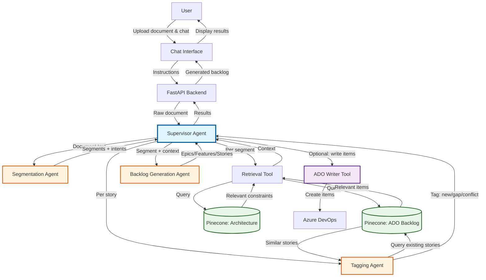

# Plan: Backlog Synthesizer POC (Simplified)

## 0. Scope & Goals

This simplified POC keeps the **same high-level architecture and flow** as the full plan, but:
- Focuses on a **single project** and a **single environment**.
- Reduces configuration surface (hard-coded defaults where reasonable).
- Implements **minimal happy-path logic** first (no retries, no advanced ranking, no evaluation suite initially).
- Keeps **Segmentation → Retrieval → Generation → Tagging → Optional ADO write** as the core pipeline.

Primary goals for the POC:
- Ingest existing ADO backlog + architecture constraints into a vector store.
- Upload a meeting note / transcript, segment it, and generate backlog items.
- Tag generated **user stories** as new / gap / conflict / extend relative to existing stories.
- Persist artifacts on disk for inspection (no UI beyond a basic upload form).

---
## 1. Multi-Agent Architecture Overview

### 1.1 Architecture Diagram

The system follows a multi-agent architecture where a Supervisor orchestrates specialized agents to process meeting notes and generate backlog items:



### 1.2 Agent Roles

- **Supervisor Agent**: Orchestrates the entire workflow, manages state, and decides when to invoke specialized agents or tools.
- **Segmentation Agent**: Splits documents into coherent segments and identifies intents.
- **Retrieval Tool**: Tool invoked by Supervisor to search Pinecone for relevant ADO backlog items and architecture constraints.
- **Backlog Generation Agent**: Creates epics, features, and user stories from segments with retrieved context.
- **Tagging Agent**: Classifies generated stories relative to existing backlog (new/gap/conflict).
- **ADO Writer Tool**: Optional tool invoked by Supervisor to persist items to Azure DevOps.

### 1.3 Data Flow

1. User uploads document and provides instructions via chat interface
2. Supervisor receives document and orchestrates processing
3. Document is segmented with intent detection
4. For each segment: retrieve relevant context → generate backlog items
5. For each story: retrieve similar stories → assign tag
6. Optionally: Supervisor invokes ADO Writer tool to persist items
7. Results returned to user via chat interface

---
## 2. Minimal Architecture Components

Components (kept from full design, simplified behavior):
- **External Loaders (CLI):**
  - ADO Backlog Loader: one-time/manual load of Epics/Features/Stories.
  - Architecture Loader: one-time/manual load of constraint docs.
- **Upload & Run API:** Simple FastAPI app with 3–4 endpoints.
- **Segmentation Agent:** Single LLM call to segment document + label intents.
- **Supervisor:** Orchestrates segmentation, retrieval, generation, tagging.
- **Backlog Generation Agent:** LLM that takes one segment + retrieved context and outputs epics/features/stories.
- **Tagging Agent:** LLM that takes one generated user story + retrieved existing stories and outputs a tag.
- **ADO Writer (optional for POC):** Simple script to create new items only (no modify/patch logic).

Non-goals / out-of-scope for this POC:
- Complex retry policies, cost monitoring, or multi-project routing.
- Custom / fine-grained Langfuse instrumentation (we rely on default Strands traces).

---
## 3. External Loaders (Simplified)

### 3.1 ADO Backlog Loader

**Purpose:** Load existing Epics/Features/Stories from one ADO project into Pinecone.

**Implementation (minimal):**
- CLI script `ado_loader.py` with a single command:
  - Inputs: ADO organization, project, PAT, Pinecone API key.
  - Fetches items of types `[Epic, Feature, Story]` via REST.
  - For each item, build `text = title + '\n' + description + '\n' + acceptanceCriteria`.
  - Embed with `text-embedding-3-small`.
  - Upsert into one Pinecone index, namespace = project name.
  - Metadata (minimal): `work_item_id`, `work_item_type`, `state`, `parent_id`, `project`, `doc_type='ado_backlog'`.

### 3.2 Architecture Loader

**Purpose:** Load a **small set** of architecture markdown/PDF/docs into Pinecone.

**Implementation (minimal):**
- CLI script `arch_loader.py`:
  - Inputs: `--project`, `--path` to folder of docs.
  - For each file, convert to text (support `.md`, `.docx`, `.pdf` using libraries like `python-docx` and `PyPDF2`).
  - Smart chunking using `RecursiveTokenChunker` from `chunking_evaluation.chunking`:
    - `chunk_size = 1000` (character length, roughly 500 tokens).
    - `chunk_overlap = 200`.
    - `separators = ["\n\n", "\n", ".", "?", "!", " ", ""]` (optimized for semantic coherence).
  - Embed each chunk with `text-embedding-3-small` (same model as ADO backlog loader).
  - Upsert into same Pinecone index, namespace = project name.
  - Metadata (minimal): `doc_type='architecture'`, `file_name`, `project`.

No retries, no observability, no JSONL artifacts required for POC (optional to add).

---
## 4. Chat Interface & API (Enhanced)

Implement a FastAPI app `app.py` with a **chat-based interface** that allows users to interact conversationally with the system:

### 4.1 Backend Endpoints

- `POST /upload`:
  - Multipart file upload.
  - Create `run_id` (UUID).
  - Save raw file to `runs/{run_id}/raw.txt`.
  - Return `{ run_id }`.

- `POST /chat/{run_id}`:
  - Request body: `{ message: string, instruction_type?: string }`.
  - Processes user instructions via chat (e.g., "Generate backlog items", "Write to ADO", "Show me conflicts").
  - Invokes **Supervisor Agent** which interprets the instruction and orchestrates appropriate agents/tools.
  - Returns: `{ run_id, response: string, status: object }`.

- `GET /backlog/{run_id}`:
  - Returns JSON content of `runs/{run_id}/generated_backlog.jsonl` (parsed as list).

- `GET /tagging/{run_id}`:
  - Returns JSON content of `runs/{run_id}/tagging.jsonl` (parsed as list).

- `GET /chat-history/{run_id}`:
  - Returns conversation history for the run.

### 4.2 Front-end: Chat Interface

- Single-page application with:
  - **File upload area**: Drag-and-drop or button to upload meeting notes/transcripts.
  - **Chat panel**: 
    - Message input box for user instructions.
    - Conversation history display showing user messages and system responses.
    - Quick action buttons: "Generate Backlog", "Show Tagging Results", "Write to ADO".
  - **Results panel**: 
    - Display generated backlog items in expandable cards.
    - Show tagging results with color-coded tags (new=green, gap=blue, conflict=red).
    - Filter and search capabilities.

### 4.3 Conversational Capabilities

The chat interface allows users to:
- Request backlog generation: "Analyze this document and create backlog items"
- Query results: "Show me all conflict items", "What gaps were identified?"
- Request modifications: "Regenerate stories for segment 3"
- Trigger ADO write: "Write the new and gap items to Azure DevOps"
- Ask for explanations: "Why was story X tagged as conflict?"

The Supervisor Agent interprets these natural language instructions and orchestrates the appropriate workflow.

---
## 5. Segmentation Agent (Simplified)

**Input:** Full document text.

**Output:** `runs/{run_id}/segments.jsonl` records with minimal fields:
- `segment_id` (int, 1..N)
- `segment_order` (same as `segment_id`)
- `raw_text`
- `intent_labels` (short list of strings)
- `dominant_intent` (string)

**Behavior:**
- Single LLM call with a prompt that:
  - Asks for segmentation into coherent chunks (roughly 500–1000 tokens each).
  - Asks to detect high-level intents per segment.
  - Returns structured JSON (array of segments).
- No retries beyond what the SDK provides.

**POC simplifications:**
- No Langfuse instrumentation requirement (optional to add later).
- No advanced quality heuristics, merging, or token metrics; only basic segmentation.

---
## 6. Per-Segment Retrieval & Generation (Simplified)

The Supervisor invokes the **Retrieval Tool** for each segment before calling the Backlog Generation Agent.

### 6.1 Intent Embedding

For each segment:
- Build an intent query string: `dominant_intent + ' ' + ' '.join(intent_labels)` plus the first ~300 characters of `raw_text`.
- Call OpenAI embeddings (`text-embedding-3-small`) to get an intent vector.

### 6.2 Retrieval Tool Invocation

The Supervisor invokes the Retrieval Tool with the intent vector. The tool queries Pinecone **twice**:
- ADO items:
  - Namespace = project.
  - Filter: `doc_type='ado_backlog'` (or via separate index if simpler).
  - `top_k = 5`.
  - **Similarity threshold**: `min_similarity = 0.7` (configurable).
  - Filter results to only include matches with `score >= min_similarity`.
- Architecture constraints:
  - Namespace = project.
  - Filter: `doc_type='architecture'`.
  - `top_k = 5`.
  - **Similarity threshold**: `min_similarity = 0.7` (configurable).
  - Filter results to only include matches with `score >= min_similarity`.

For POC, skip complex ranking; just use similarity score returned by Pinecone and apply the threshold filter to keep only relevant results.

### 6.3 Prompt Assembly

Build a simple prompt template:

- Section 1: Original segment text.
- Section 2: Retrieved ADO items (id, type, title, short description).
- Section 3: Retrieved architecture chunks (short text + identifiers).
- Section 4: Instructions to generate epics/features/stories + ACs.

### 6.4 Generation Agent Call

- Single LLM call per segment with the above prompt.
- Response format: structured JSON list of backlog items with fields:
  - `type` (Epic|Feature|Story)
  - `title`
  - `description`
  - `acceptance_criteria` (list of strings)
  - `parent_ref` (optional ID or title of parent epic/feature)

Supervisor:
- Parses JSON.
- Assigns internal IDs (`epic_id`, `feature_id`, `story_id` counters within the run).
- Appends all items to `runs/{run_id}/generated_backlog.jsonl`.

POC simplifications:
- No retries beyond one optional re-call if JSON invalid.
- No constraint violation flags or AC delta computation (can be added later).

---
## 7. Per-Story Retrieval & Tagging (Simplified)

Once all segments are processed and backlog items are generated:

### 7.1 Story Selection

- Filter `generated_backlog.jsonl` to only `type == 'Story'`.

### 7.2 Story Embedding & Retrieval

For each story:
- Build story text: `title + '\n' + description + '\n' + '\n'.join(acceptance_criteria)`.
- Embed with `text-embedding-3-small`.
- Query Pinecone for existing user stories:
  - Namespace = project.
  - Filter: `work_item_type='Story'` (or `User Story`, depending on loader).
  - `top_k = 10`.
  - **Similarity threshold**: `min_similarity = 0.7` (configurable).
  - Filter results to only include matches with `score >= min_similarity`.

**Early exit optimization:**
- If **all** retrieved stories fall below the threshold (i.e., no relevant matches found), automatically tag the story as `"new"` without calling the Tagging Agent LLM.
- Record this decision in `tagging.jsonl` with `decision_tag="new"`, `related_ids=[]`, and `reason="No similar existing stories found (all below threshold)"`.

### 7.3 Tagging Agent Call

**Only called if at least one existing story passes the similarity threshold** (see 7.2).

Prompt includes:
- Generated story (title, description, ACs).
- List of retrieved existing stories (id, title, short description, similarity score).
- Simple rules for deciding **one** of: `new`, `gap`, `conflict`.

LLM returns structured JSON:
- `decision_tag`: `"new" | "gap" | "conflict"`
- `related_ids`: list of ADO work item IDs considered most relevant.
- Optional `reason` (short text for debugging).

Supervisor:
- Writes tagging records to `runs/{run_id}/tagging.jsonl`.
- Also updates in-memory backlog items with `assigned_tag`.

POC simplifications:
- Threshold filtering happens before LLM call (see 7.2 early exit).
- LLM only reasons over stories that are sufficiently similar.
- Only three tag values: `new` (no similar stories), `gap` (fills a gap or extends existing work), `conflict` (contradicts existing stories).

The tagging output produced here is the main input to the simple evaluation in Section 9.

---
## 8. ADO Writer Tool (Supervisor-Invoked)

The ADO Writer is implemented as a **tool** that the Supervisor Agent can optionally invoke based on user instructions via chat.

### 8.1 Tool Interface

**Tool Name**: `write_to_ado`

**Input Parameters**:
- `run_id`: The run identifier to read generated backlog from.
- `filter_tags`: List of tags to include (default: `["new", "gap"]`).
- `dry_run`: Boolean flag for preview mode (default: `false`).

**Output**:
- `created_items`: List of created ADO work item IDs.
- `summary`: Object with counts of created epics/features/stories.
- `errors`: List of any errors encountered.

### 8.2 Implementation

Implemented in `ado_writer_tool.py`:

**Behavior**:
1. Reads `runs/{run_id}/generated_backlog.jsonl` and `tagging.jsonl`.
2. Filters items based on `filter_tags` (default includes only items tagged as `new` or `gap`).
3. For each filtered item:
   - Creates new ADO work items (Epics/Features/Stories) via REST API.
   - Maintains parent-child relationships.
   - Tracks created item IDs.
4. Returns structured result with created item IDs and summary.

**POC Limitations**:
- **Only creates new items** (no PATCH/modify of existing items).
- No idempotency hashing or duplicate detection.
- No advanced retry logic beyond basic SDK retries.
- Items tagged as `conflict` are excluded by default (require manual review).

### 8.3 Supervisor Integration

The Supervisor Agent can invoke this tool when:
- User explicitly requests: "Write to ADO", "Create these items in Azure DevOps".
- User asks for dry-run preview: "Show me what would be created in ADO".
- As part of an automated workflow if configured.

The tool invocation is logged and results are displayed in the chat interface.

---
## 9. Minimal Evaluation

For the POC, we add a **lightweight tagging evaluation** step to check whether the Tagging Agent is behaving sensibly on a small labeled dataset.

### 9.1 Tagging Test Dataset

- Store a simple JSONL file at `datasets/tagging_test.jsonl` with records:
  - **Generated story (the one being tagged):**
    - `story_title`
    - `story_description`
    - `story_acceptance_criteria` (list of strings)
  - **Existing stories context (snapshot of what was available at tagging time):**
    - `existing_stories` (list of objects with `title`, `description`, `acceptance_criteria`)
  - **Gold label:**
    - `gold_tag` (`"new" | "gap" | "conflict"`)
    - `gold_related_ids` (optional list of identifiers or titles the human labeler considered when deciding the tag)

### 9.2 Evaluation Script

- CLI script `evaluate_tagging.py`:
  1. Loads `datasets/tagging_test.jsonl`.
  2. For each record:
     - Takes the **generated story** (title, description, ACs).
     - Uses the **provided `existing_stories`** snapshot (no live retrieval from Pinecone; uses the fixed set from the dataset).
     - Calls the **Tagging Agent LLM** with the same prompt structure used in the main flow.
  3. Compares predicted `decision_tag` with `gold_tag`.
  4. Counts TP/FP/FN per class and computes precision/recall/F1 per tag and macro-average.
  5. Writes a small JSON report to `eval/tagging_f1.json`.

This approach ensures the evaluation is **reproducible** (same existing stories context every time) and tests the LLM's reasoning given a fixed comparison set.

This keeps evaluation implementation minimal but still provides a concrete quality signal for the tagging behavior.

---
## 10. Minimal Configuration

For the POC, use a single simple configuration file `config.poc.yaml`:

```yaml
ado:
  organization: your-org
  project: your-project
  pat_env_var: ADO_PAT

pinecone:
  api_key_env_var: PINECONE_API_KEY
  index_name: brd-poc
  environment: us-east-1

openai:
  api_key_env_var: OPENAI_API_KEY
  embedding_model: text-embedding-3-small
  chat_model: gpt-4o

retrieval:
  min_similarity_threshold: 0.7  # Filter out results below this score

project:
  name: your-project
```

No per-feature toggles, no thresholds configuration. Any extra knobs (e.g. `top_k`) can be hard-coded constants in code for this POC.

---
## 11. POC Success Criteria

The POC is considered successful if we can:
- Run loaders once to populate Pinecone with **real** ADO backlog and a small architecture corpus.
- Upload a real meeting note / transcript and:
  - See it segmented into 3–10 reasonable segments.
  - See 5–30 generated backlog items (including user stories) based on those segments.
  - See each story tagged as new/gap/extend/conflict with at least **plausible** reasoning.
- Inspect all artifacts under `runs/{run_id}/` to manually verify quality.

Future iterations can then:
- Add formal evaluation (F1), retries, constraint checks, and richer observability.
- Generalize configuration, support multiple projects/environments, and refine prompts.
